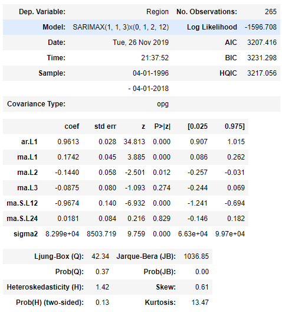
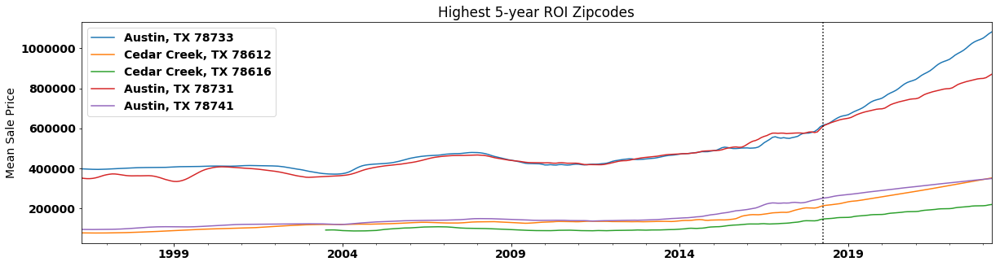
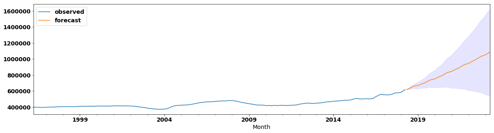
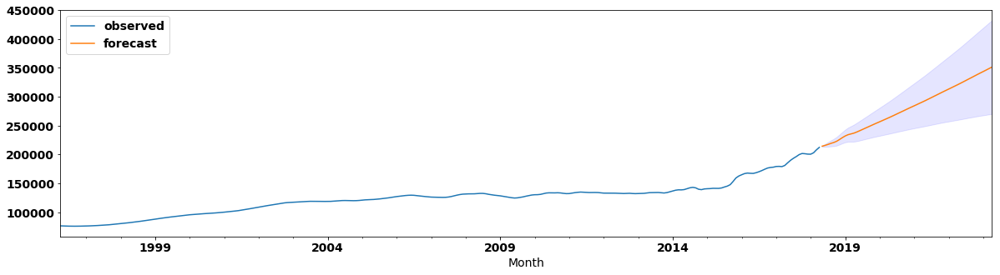
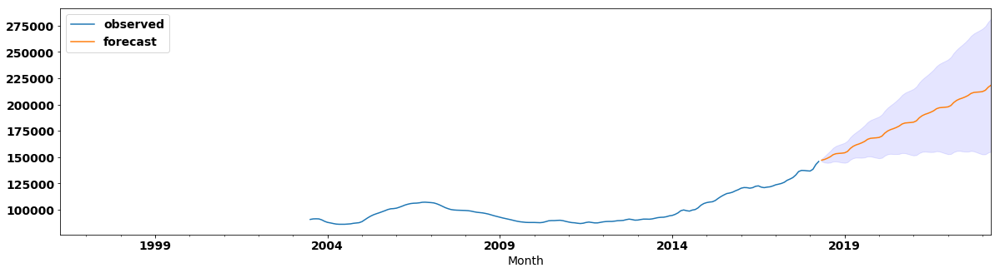
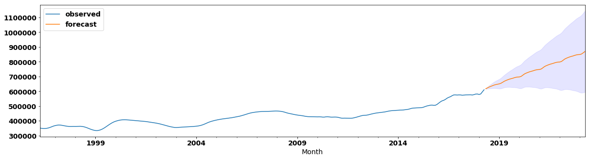
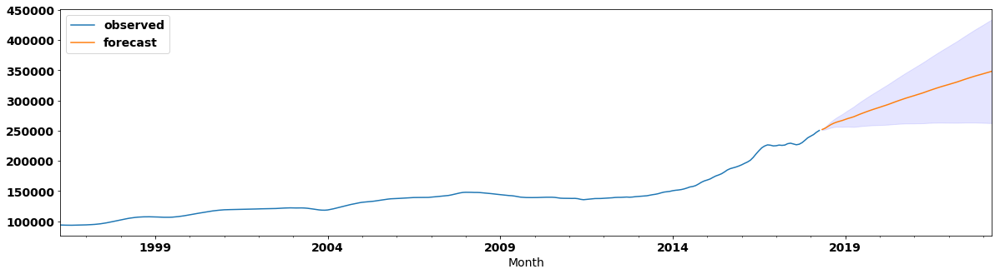
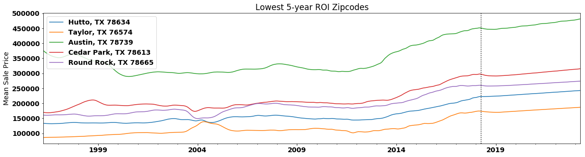

# Mod 4 Project

## Introduction
This project is an analysis of zip codes within the Greater Austin Area to determine which five zip codes provide the best investment. For this project, the best investment will be defined as the largest return on investment (ROI) over a 5 year period. The data for this project comes from the zillow_data.csv file included in this repository.
 

## Greater Austin Area
The Greater Austin Area is composed of 30 cities spanning 5 counties, containing a total of 71 separate zip codes. It is the fourth largest metropolitan area in Texas, and 35th largest in the US, with approximately 1.7 Million people as of the 2010 Census, expanding to an estimated 2.1 Million in 2018.
 

## Process
Starting with the full Zillow database, I first narrowed my data down to only zip codes in the Greater Austin Area. From there I formatted the data from a wide format to a long format, as well as separated the zip codes by county to allow for some comparisons at the county level.
 
 
Next I performed some EDA to get a visual idea of the timelines compared by zip code, as well as compared by county, and then decomposed the county-level data to see its trend, seasonality, and residual plots to get an idea of its stationarity. I then tested various SARIMA parameters to determine the best combination for my model, then created my SARIMAX model from those parameters and compared the results to the ACF and PACF plots for a visual comparison to the expected results.
 
 
With my first model, where I only used more recent data (2012 and later), I had a couple of outliers that I removed prior to getting and plotting my forecasts, however, upon further consideration and deciding to recreate the models using the full data all the way back to 1996, those outliers fell into line, and I felt much more comfortable with my results.
 

## Model

 

## Results

#### Top Five with Confidence Band
 
78733, Austin, TX
 

 
78612, Cedar Creek, TX

 
78616, Cedar Creek, TX

 
78731, Austin, TX

 
78741, Austin, TX

 

#### Bottom Five Zip Codes
 

 

## Conclusion
From our original results, looking at the largest 5-year return on investment, the best five zip codes were 78612, 78676, 78741, 78957, and 78758, in that order. Meanwhile, the five worst zip codes for 5-year ROI were 78735, 78653, 78665, 78733 and 78613, in that order.
 
 
Using the full dataset, oddly enough our second worst zip code, 78733, jumped all the way to the top, while 78612 moved down one spot and 78741 moved down a couple, putting our top five largest 5-year return on investment zip codes as 78733, 78612, 78616, 78731, and 78741 in that order. On the other end, 78613 gained one spot, while 78665 fell to the bottom, putting our worst five investment zip codes as 78634, 76574, 78739, 78613, and 78665 in that order.
 
 
I feel a bit better about this secondary result, based on the rest of my plotting, mainly that my PACF plot didn't have that odd spike around the 30 lag mark, however, my model's AIC was much much higher, and the kurtosis of my residuals was quite a bit higher as well. I still feel like there's more that I can perfect about this model, but for an "I want to come back and add this to my project" section, I really like how it came out.

## Future Work
In the future, I'm going to have to look into moving, because I currently live in the 78613 area code. Thankfully I'm just renting, but oh boy do I not want to buy a home here, assuming my modeling was all correct.
 
 
I also need to continue to explore how time series work, because I felt like I was fumbling my way through most of this project, and while I do feel comfortable with the second set of results I obtained, I'm nowhere near comfortable in my workflow just yet.
 
 
[Back to Introduction](#Introduction)
